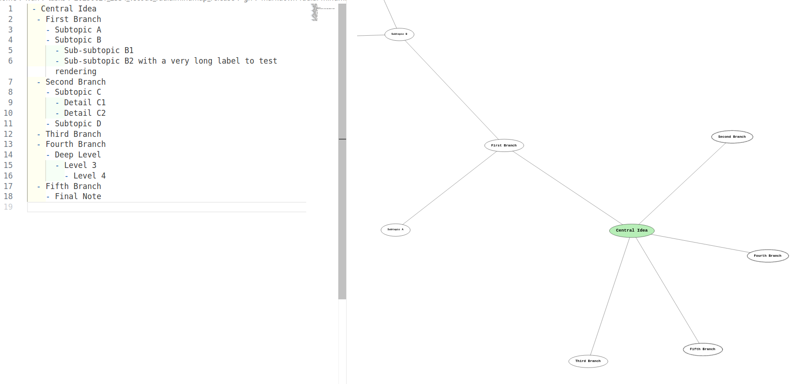

# Markdown Radial MindMap



Visualize Markdown lists as interactive radial mind maps directly inside VSCode.

## Features

- Converts Markdown lists (with `-` or `*`) into an interactive radial mind map
- Live synchronization: changes in Markdown are instantly reflected in the map
- Supports configurable node colors, font, padding, and more
- Click on nodes to collapse/expand branches
- Works fully offline, no external dependencies

## Configuration

You can customize the visualization in your `settings.json`:

| Setting                                 | Description                        | Default          |
|------------------------------------------|------------------------------------|------------------|
| `markdownRadialMindMap.nodeColor`        | Node background color              | `#ffffff`        |
| `markdownRadialMindMap.rootNodeColor`    | Root node background color         | `#b7eeb7`        |
| `markdownRadialMindMap.linkColor`        | Link color                         | `#333333`        |
| `markdownRadialMindMap.nodeStrokeColor`  | Node border color                  | `#000000`        |
| `markdownRadialMindMap.fontFamily`       | Node label font family             | `Courier New`    |
| `markdownRadialMindMap.rootFontSize`     | Root node font size (px)           | `20`             |
| `markdownRadialMindMap.fontSizeDelta`    | Font size decrement per level      | `4`              |
| `markdownRadialMindMap.nodePaddingX`     | Horizontal node padding            | `30`             |
| `markdownRadialMindMap.nodePaddingY`     | Vertical node padding              | `20`             |

Example (`settings.json`):

```json
{
  "markdownRadialMindMap.nodeColor": "#fafbfc",
  "markdownRadialMindMap.rootNodeColor": "#c4f7c5",
  "markdownRadialMindMap.linkColor": "#4c6ef5"
}
